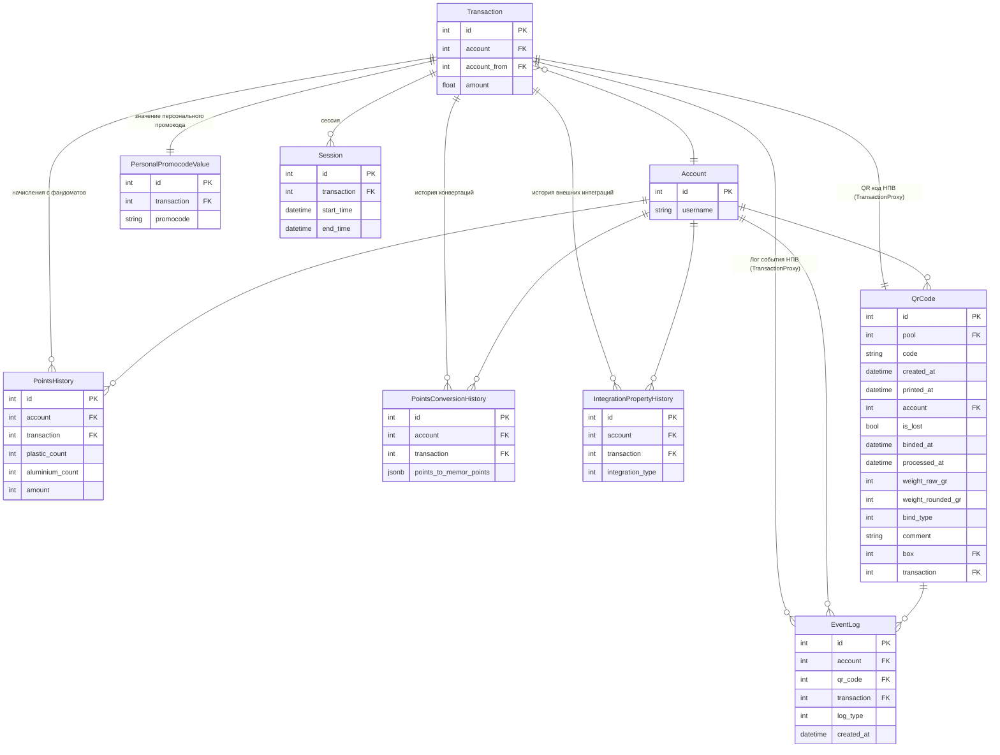

```mermaid
erDiagram
    Transaction {
        int id PK
        int account FK
        int account_from FK
        float amount
    }

    Account {
        int id PK
        string username
    }

    PointsHistory {
        int id PK
        int account FK
        int transaction FK
        int plastic_count
        int aluminium_count
        int amount
    }

    PointsConversionHistory {
        int id PK
        int account FK
        int transaction FK
        jsonb points_to_memor_points
    }

    IntegrationPropertyHistory {
        int id PK
        int account FK
        int transaction FK
        int integration_type
    }

    PersonalPromocodeValue {
        int id PK
        int transaction FK
        string promocode
    }

    Session {
        int id PK
        int transaction FK
        datetime start_time
        datetime end_time
    }

    QrCode {
        int id PK
        int pool FK
        string code
        datetime created_at
        datetime printed_at
        int account FK
        bool is_lost
        datetime binded_at
        datetime processed_at
        int weight_raw_gr
        int weight_rounded_gr
        int bind_type
        string comment
        int box FK
        int transaction FK
    }

    EventLog {
        int id PK
        int account FK
        int qr_code FK
        int transaction FK
        int log_type
        datetime created_at
    }

    Transaction }o--|| Account : ""
    Transaction ||--o{ PointsHistory : "начисления с фандоматов"
    Transaction ||--o{ PointsConversionHistory : "история конвертаций"
    Transaction ||--o{ IntegrationPropertyHistory : "история внешних интеграций"
    Transaction ||--|| PersonalPromocodeValue : "значение персонального промокода"
    Transaction ||--o{ Session : "сессия"
    Transaction ||--|| QrCode : "QR код НПВ (TransactionProxy)"
    Transaction ||--o{ EventLog : "Лог события НПВ (TransactionProxy)"
    Account ||--o{ PointsHistory : ""
    Account ||--o{ PointsConversionHistory : ""
    Account ||--o{ IntegrationPropertyHistory : ""
    Account ||--o{ QrCode : ""
    Account ||--o{ EventLog : ""
    QrCode ||--o{ EventLog : ""
```
